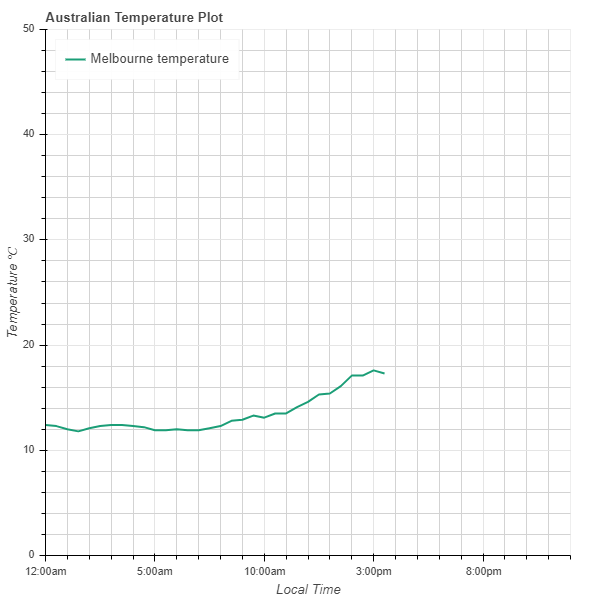
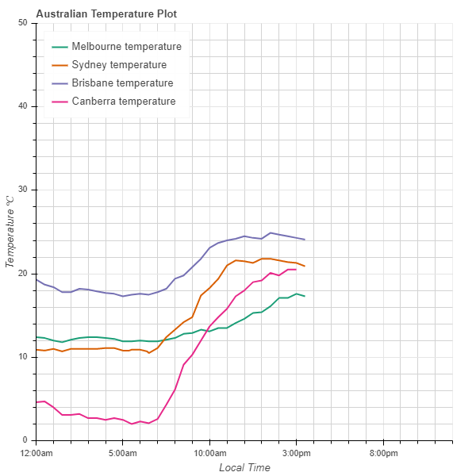
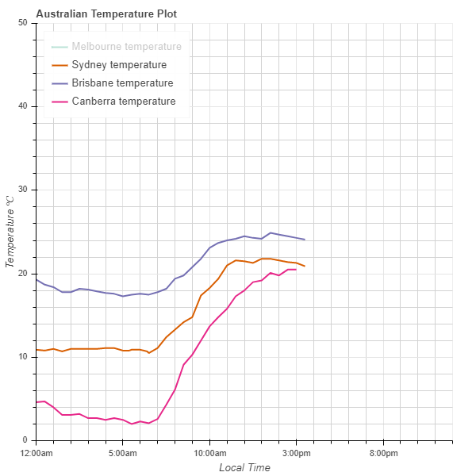

# Bureau of Meteorology - plots
Plot the current day's temperature from midnight to the current time. Data taken from the Bureau of Meteorology webpage www.bom.gov.au.


## Example
In the Python console with the file `temperature_plots.py` saved in the current directory, import the file and collect data for Melbourne.
```
import temperature_plots
today = temperature_plots.BOMplots('Melbourne')
```

Plot the temperature graph for today in Melbourne
```
today.plot()
```
The plot is produced as an html file and can be opened in your internet browser. The graph should look something like this


If you want to add more cities, you can do so like this
```
today('Sydney')
today(['Brisbane', Canberra']) 
```
And then plot using the same command as before
```
today.plot()
```
The new plot should look something like this


If your plot is getting too crowded, you can click the name of a city on the legend and this will remove that city's curve from the plot. Here's what happened when I clicked Melbourne

